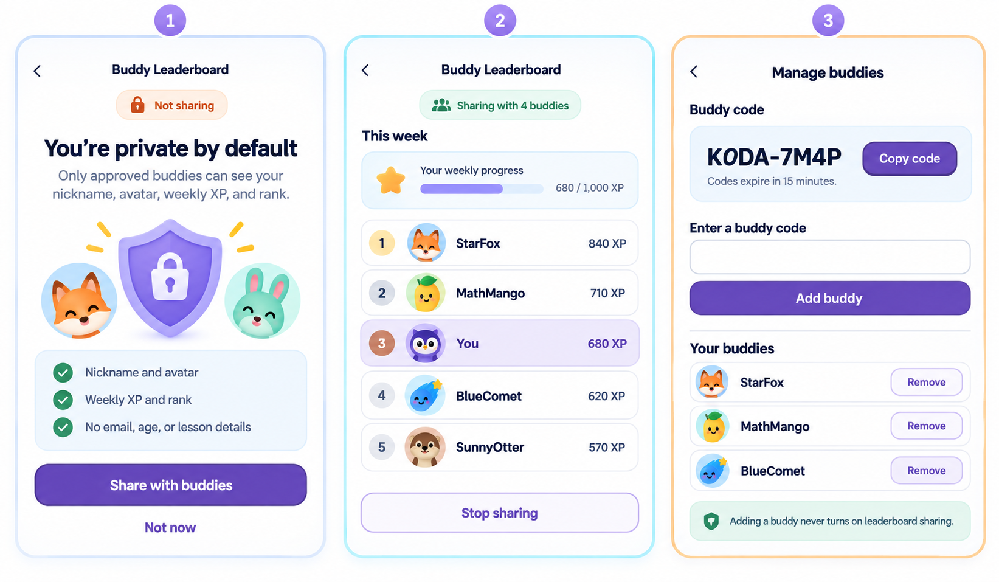

# Leaderboard Privacy

Every leaderboard is private by default. A missing consent record means the
learner is not shared, and no leaderboard projection may include them.

## Product contract

- Sharing is a three-way choice: Private, Buddies only, or Public.
- Existing and legacy opt-ins remain Buddies only; migration never promotes a
  learner to Public.
- Public requires a separate confirmation naming its audience: any signed-in
  Koda learner. It is not anonymously available on the web.
- Buddies-only sharing is limited to direct, accepted buddies. There is no
  friend-of-a-friend visibility.
- Adding a buddy never enables leaderboard sharing.
- A managed child cannot approve their own sharing; an owner or parent must do it.
- A self-managed student may approve only their own learner profile.
- Turning sharing off takes effect immediately.
- Public leaderboard data is limited to a chosen nickname, avatar, weekly XP,
  and rank. Email, age, family identity, and lesson-level history are never shared.
- The weekly ranking endpoint remains empty until the requesting learner has
  opted in; sharing is not a ticket for a private account to observe others.

## Buddy connections

- A code is a deliberate offer and accepting it is the other learner's
  deliberate response; both acts are required before a relationship exists.
- Codes use the `KODA-XXXXXX` shape, expire after 15 minutes, are stored only as
  server-peppered hashes, and work once.
- Generating a replacement invalidates the previous live code.
- A managed child may view their own accepted buddies but cannot create,
  accept, remove, block, or unblock a relationship.
- Removing hides the relationship from both sides immediately.
- Blocking prevents reconnection. Unblocking does not reconnect anybody; a new
  code is required.
- An accepted buddy sees a nickname and avatar only while that peer's separate
  leaderboard consent remains enabled.
- Relationship responses expose an opaque relationship id, never another
  learner id or family id.

## Weekly ranking

- A week runs Monday through Sunday in the offset supplied by the learner's
  device, bounded to real-world UTC offsets.
- The board contains only the requesting learner and currently accepted,
  unblocked buddies whose separate sharing choice is still enabled.
- XP is calculated by the server from idempotent `lesson_completed` outcomes
  and the deployment scoring rules. A client-provided `xpEarned` value is never
  trusted.
- Previous-week, abandoned, incomplete, and malformed outcomes do not add XP.
- Ties are deterministic, and output rows contain only rank, `isYou`, nickname,
  avatar seed, and weekly XP. Internal learner and family identifiers remain
  server-side.
- Both boards show the top 20. If the current learner ranks below 20, their row
  is appended with its true rank; rank 21 is not misrepresented as rank 20.
- The Public board contains only explicit Public opt-ins. The Buddies board
  contains only the learner and their accepted, unblocked sharing buddies.

## Visual contract

The screens use the existing Koda theme and shared components: white
canvas, deep navy rounded typography, lavender primary actions, pale blue and
mint cards, cyan/orange accents, generous spacing, and rounded corners.

- `Leaderboard` is a permission-filtered destination in the desktop sidebar.
- On phones it is one of the four persistent bottom tabs; adult-only Children
  management remains available from the Settings shortcuts.
- Parents with several learners choose whose board they are managing. A learner
  session is fixed to itself.
- Public/Buddies is a large segmented control on mobile. Rankings stay first;
  buddy management collapses behind a dedicated button on narrow screens.
- Buddy management uses a compact, height-limited list with nickname search, so
  many connections do not turn the page into an unbounded scroll.
- Private, empty-week, no-buddies, loading, offline/error, and read-only child
  states each have explicit copy rather than a blank card.
- Changing the selected learner clears the previous projection before the new
  consent state loads.

