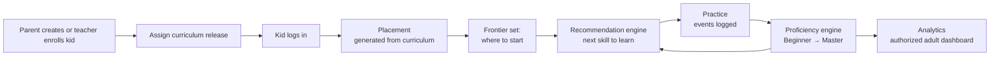

# Koda — Progression System Design

**Onboarding → Course → Practice → Analytics, with a server-authoritative
progression system that carries a student from Beginner to Master.**

> This is the plan of record. It is written to be **modified fast**: every tunable
> number lives in one place ([§9 Tuning knobs](#9-tuning-knobs)), each build phase is
> independent ([§8 Build phases](#8-build-phases)), and the two engines are pure
> functions you can rewrite without touching the API or the models.

---

## 1. What we're building

A parent creates a kid account—or a teacher enrolls the kid in an authorized
classroom—then assigns a grade and curriculum release. The first thing the kid does
is a short **placement** generated from that immutable release, so we know where to
start them. From then on, every login and every question is logged. A
**recommendation engine** reads that log and tells the kid which skill to practice
next across their active assignments — a mix of *new* skills and *review* of skills
at risk of being forgotten.
Following a recommendation is optional (the kid can skip). As they practice, a
**proficiency engine** moves each skill up a five-rung ladder from Beginner to
Master. Authorized parents and teachers see it in an analytics dashboard.



Two rules hold the whole thing together:

1. **Placement decides where practice *starts*; it never awards a mastery level.**
   Levels are *earned* through logged play, never granted by a quiz.
2. **The recommendation is advice, not a lock.** The kid may follow it, skip it,
   or free-practice. Skips are logged and feed back into the engine.
3. **Published learning content is immutable.** Assignments, placement attempts,
   recommendations, and play events point to the exact release that produced them.
4. **The backend owns progression decisions.** The event log is the evidence;
   server-side engines produce mastery and recommendations. Frontend engines are
   previews/reference implementations only.

---

## 2. Core concepts (glossary)

| Term | Meaning | Lives in |
|---|---|---|
| **Skill** | The unit of learning and mastery, e.g. *"Count objects to 10"*. Its ID stays stable across releases of one curriculum. | `curriculum/types.ts`, `curriculum_releases` |
| **Question** | A playable item tagged to one skill via `skillId` and a standard optional `difficulty`. Released question content is immutable. | `QuestionDeck`, `curriculum_releases` |
| **Curriculum release** | Immutable snapshot of a published curriculum tree, playable questions, and versioned asset references. | `curriculum_releases` |
| **Proficiency level** | One of `not_started → beginner → developing → proficient → master`, **per (student, curriculum, skill)**. | backend scoring engine, `mastery_states` |
| **Skill score** | 0–1 composite behind the level (first-try, accuracy, independence, speed). | backend scoring engine; frontend reference |
| **Assignment** | The link "this student studies this curriculum release/scope", plus delivery mode and priority. A student may have multiple active assignments. | `assignments` |
| **Placement** | A short quiz generated from an assigned release that sets the starting frontier. No separate authored form; the served item manifest is stored for reproducibility. | `buildPlacement()`, `placements` |
| **Progression eligibility** | Evidence that a student may move past a skill. Placement can supply this without awarding mastery. | `progression_states` |
| **Frontier** | The next ordered skill eligible for new learning within an assignment. | `progression_states` |
| **Recommendation** | The ranked list of skills to practice next (new + review + reinforce). | `recommendationEngine`, `/learning/today` |
| **Recommendation run** | Immutable record of the ranked candidates, reasons, engine/config versions, and items actually served. | `recommendation_runs` |
| **Learning event** | One logged action: login, slide view, attempt (with outcome), hint, skip, complete. | `learning_events` |

---

## 3. The two engines

Both are **pure, recomputable server-side functions**. The append-only event log,
immutable releases, and versioned configuration are their evidence. We cache results
(`mastery_states`, `progression_states`) for fast queries, stamped with the engine and
configuration revision that produced them.

### 3.1 Proficiency engine (frontend reference built; backend port required)

`frontend/src/services/scoringEngine.ts` is the tested reference implementation. Before
MongoDB mastery is written, the same pure rules must run on the backend against a
validated `ScoringConfig`. Shared language-neutral fixtures must produce identical
results in both implementations. The frontend displays server results; it does not
authoritatively promote a student.

- Score = `0.45·firstTry + 0.20·accuracy + 0.20·(1−hints) + 0.15·speed`.
  Speed uses active interaction time, not wall-clock time, and can be disabled or
  normalized by component/accessibility profile.
- Promotion needs a **score** *and* a **gate** (volume, distinct sessions/days,
  hard-question band, retention window). No lucky-streak Masters.
- `nextReviewAt` grows after **successful** review evidence (Developing ~1d,
  Proficient ~4d, Master ~14d). A failed review remains due and becomes reinforcement;
  simply attempting a due skill never postpones it.
- Recent evidence is tracked separately from the lifetime score so old success cannot
  hide a current regression.

Full ladder and worked example: see the interactive sketch and `scoringEngine.test.ts`.

### 3.2 Recommendation engine (new — spec below)

`recommend(student)` → an ordered queue of skills to practice next. Pure function of:
`SkillScore[]` + `ProgressionState[]` + ordered immutable releases + all active
assignment scopes + recent recommendation decisions/skips.

**Priority order** (highest first — fix gaps, then protect retention, then advance):

| # | Bucket | Rule | Why |
|---|---|---|---|
| 1 | **Reinforce** | in-scope due skills scored below `REINFORCE` (0.60) **or whose latest review failed** | a real/current gap — re-teach before moving on |
| 2 | **Review** | Developing+/Proficient+ skills whose `nextReviewAt` has passed | keep what's learned from decaying |
| 3 | **New** | next `not_started` skills in curriculum order whose explicit prerequisites are progression-eligible (frontier and beyond) | forward progress |
| 4 | **Stretch / free** | nothing due → offer the next new skill early, or hand off to free practice | never a dead end |

**Session assembly.** A session shows `SKILLS_PER_SESSION` items (default 3). When an
eligible new skill exists, reserve one slot for it. Fill at most
`MAX_NON_NEW_PER_SESSION` slots (default 2) with reinforce/review items. With multiple
assignments, select candidates by assignment priority and round-robin subject balance
so one large curriculum cannot starve the others.
Each item carries `{ skillId, kind: reinforce|review|new|stretch, reason, optional: true }`.

**"Can miss or not."** Every recommendation is `optional`. If the kid **skips**, we
log a `recommendation_skipped` event; the engine drops that skill to the back of the
queue for `SKIP_COOLDOWN` (default 1 session) and surfaces the next candidate. If a
skill is skipped repeatedly, it's flagged for the parent, not force-fed. Free-practice
plays still score — they just don't come from the queue.

Pseudocode:

```
recommend(scores, progression, releases, assignments, recentRuns, opts):
    inScope   = skills from every active assignment/release filtered by scope
    state     = materialize every inScope skill with score-or-not_started
    due       = state where s.isDue
    reinforce = due ∩ ({score < REINFORCE} ∪ {latestReviewFailed}) # bucket 1
    review    = due ∩ {level ≥ developing} − reinforce          # bucket 2
    new       = ordered(state where level == not_started
                         and prerequisitesEligible(skill, progression)
                         and order ≥ frontier.order)            # bucket 3
    dueSlots = interleaveByAssignment(reinforce, review)
               [:MAX_NON_NEW_PER_SESSION]
    newSlots = interleaveByAssignment(new)
    queue = dueSlots + reserveAtLeastOne(newSlots when available)
    if queue empty: queue = [nextStretch or FREE_PRACTICE]
    drop items skipped within SKIP_COOLDOWN
    return deterministicRank(queue)[:SKILLS_PER_SESSION] with reasons
```

Every returned queue is persisted as a `RecommendationRun`; this does not make the
run a mastery source of truth, but it makes “why did the system show this?” auditable.

---

## 4. The student journey, step by step

| Step | Actor | What happens | Endpoint(s) |
|---|---|---|---|
| 1 | Parent / school | Create or enroll a kid account (name, avatar, birth year, optional PIN) | `POST /family/children` · classroom enrollment |
| 2 | Parent / teacher | Assign a published curriculum release; pick Scheduled or Self-paced | `POST /assignments` |
| 3 | Kid | Log in (PIN) or parent-launch | `POST /auth/student/login` · `/student/launch` |
| 4 | Kid | If placement pending → play the quiz generated from the assigned release | `GET /student/placement/quiz` → `POST /student/placement/{id}/submit` |
| 5 | System | Placement result sets the **frontier** + progression eligibility; it does not award mastery | (server, in `submit`) |
| 6 | Kid | Home shows today's recommended skills (or free practice) | `GET /learning/today` |
| 7 | Kid | Practice; every action logged; can skip a recommendation | `POST /events` · `POST /events/skip` |
| 8 | System | Ingest updates `mastery_states`; levels climb | (server, in `events`) |
| 9 | Authorized adult | Dashboard: proficiency map, rank, what's next & why | `GET /progress/{student_id}` · `/analytics/*` |

---

## 5. Data model

MongoDB via Beanie `Document`s, matching the existing style (`snake_case`, string FKs,
`revision`, timestamps). **Existing collections we build on:** `users`, `students`,
`grades`, `subjects`, `curriculum`, `question_decks`, `svg_libraries`,
`learning_events`, and `content_audits`.

### 5.1 New / changed collections

#### `curriculum_releases` — immutable published content
```python
class CurriculumRelease(Document):
    release_id: str               # immutable public identifier
    curriculum_id: str            # stable identity across releases
    owner_id: str
    revision: int
    tree: dict                    # immutable tree snapshot
    question_manifest: list[dict] # playable snapshots + private grading refs + hashes
    asset_manifest: list[dict]    # resolved asset snapshots/version refs + hashes
    published_by: str
    published_at: datetime
    # indexes: release_id UNIQUE, (curriculum_id, revision) UNIQUE
```
The editable `curriculum`, `question_decks`, and `svg_libraries` remain drafts.
Publishing resolves and validates them into one release. If payload size approaches
MongoDB's document limit, manifests may reference immutable release-item documents;
the release boundary and hashes remain the same.

#### `assignments` — who studies what
```python
class Assignment(Document):
    owner_id: str                 # parent/teacher who assigned
    student_id: str               # FK students
    curriculum_id: str            # FK curriculum
    release_id: str               # immutable release pinned at assign time
    grade_id: str                 # grade anchor within the release
    scope: dict                   # {"kind": "all"|"units"|"skills", "ids": [...]}
    mode: str                     # "scheduled" | "self_paced"
    schedule: dict | None         # {"skills_per_session": 3, "cadence": "daily", ...}
    priority: int = 100           # merge order when several assignments are active
    placement_required: bool = True
    status: str = "active"        # active | paused | completed | archived
    created_at: datetime; updated_at: datetime
    # indexes: (student_id, status, priority), (owner_id, updated_at desc)
```
A student may have multiple active assignments. Duplicate active assignments for the
same `(student_id, release_id, scope)` are rejected. Re-anchoring creates a new
assignment/release link rather than silently mutating historical evidence.

#### `classrooms` / `class_enrollments` — teacher authorization scope
```python
class Classroom(Document):
    owner_teacher_id: str
    name: str
    archived_at: datetime | None

class ClassEnrollment(Document):
    classroom_id: str
    student_id: str
    status: str                   # active | removed
    created_at: datetime
    # index: (classroom_id, student_id) UNIQUE
```
Admins may access all students. Parents may access guardianed children. Teachers may
access only actively enrolled students in their classrooms; the current broad
"teacher can read any student" rule must be removed before this feature ships.

#### Placement is **generated from the curriculum** — no separate authored form

There is deliberately **no `placement_forms` collection and no parallel placement
tree.** Placement questions *are* curriculum questions (already tagged to skills), so
authoring a second tree would only duplicate content and drift when the curriculum
changes. Instead the quiz is built once from the assignment's immutable release by a
pure generator. The served manifest is stored so submission and later audits use the
exact same questions:

```
buildPlacement(release, scope, cfg, deterministicSeed) → PlacementQuiz
   walk skills in curriculum order (checkpoints only, if flagged)
   → sample cfg.per_skill questions each, spanning difficulty
   → cap at cfg.checkpoint_cap, thinned evenly across units
```

Skills gain two optional fields. Both are validated when publishing: prerequisite
references must exist in the same curriculum and form a directed acyclic graph.

```python
# curriculum/types.ts — Skill gains:
#   placementCheckpoint?: boolean
#   prerequisiteSkillIds?: string[]
```
```python
# SystemSettings.scoring.placement (admin, §12) — the generator rules:
#   { per_skill: 2, checkpoint_cap: 8, pass_threshold: 0.80,
#     checkpoints_only: true }
```

#### `placements` — reproducible placement attempt and result
```python
class Placement(Document):
    student_id: str; assignment_id: str; grade_id: str; curriculum_id: str
    release_id: str
    generator_revision: int
    scoring_revision: int
    status: str = "pending"       # pending | in_progress | completed | skipped
    item_manifest: list[dict]     # ordered question/skill/difficulty/hash snapshot
    responses: list[dict]         # selected response; server computes correctness
    score_by_skill: dict          # {skill_id: 0..1}
    frontier_skill_id: str | None # first not-yet-shown skill in curriculum order
    eligible_skill_ids: list[str] # sequencing evidence only; NOT mastery
    completed_at: datetime | None
    created_at: datetime
    # index: (student_id, assignment_id) UNIQUE
```
> The manifest is not a second authored placement form. It is an immutable receipt of
> what the generator served, required for safe submit, support, and audit.

#### `progression_states` — sequencing, separate from mastery
```python
class ProgressionState(Document):
    student_id: str; assignment_id: str; curriculum_id: str; release_id: str
    frontier_skill_id: str | None
    eligible_skill_ids: list[str]
    evidence: dict                 # placement/event ids and rule revision
    updated_at: datetime
    # index: (student_id, assignment_id) UNIQUE
```
Placement and short confirmation runs can move the frontier without granting a
proficiency rung. Mastery remains governed by the full volume/spacing gates.

#### `mastery_states` — cached proficiency per (student, curriculum, skill)
```python
class MasteryState(Document):
    student_id: str; skill_id: str; curriculum_id: str
    level: str                    # not_started|beginner|developing|proficient|master
    score: float                  # 0..1
    components: dict              # {first_try, accuracy, independence, speed}
    plays: int; sessions: int; distinct_days: int; hard_plays: int
    last_practiced_at: datetime | None
    last_successful_review_at: datetime | None
    last_review_outcome: str | None
    recent_score: float
    next_review_at: datetime | None   # THE scheduler field — query "due" off this
    promoted_at: datetime | None      # when it last reached its current level
    highest_earned_level: str         # retained trophy, even when review is due
    scoring_revision: int
    engine_revision: str
    last_event_id: str | None
    updated_at: datetime
    # indexes: (student_id, curriculum_id, skill_id) UNIQUE,
    #          (student_id, next_review_at)
```
> Recomputable from `learning_events` at any time (that's the source of truth). Stored
> so we can answer "which skills are due?" and "what's the rank?" without replaying the
> whole log. `highest_earned_level` supports the chosen “keep the trophy, mark due”
> behavior while `level`/`score` describe current evidence.

#### `recommendation_runs` — decision audit
```python
class RecommendationRun(Document):
    student_id: str
    session_id: str
    assignment_release_ids: list[str]
    scoring_revision: int
    engine_revision: str
    candidates: list[dict]        # rank, bucket, score, reason, exclusion
    served_items: list[dict]
    created_at: datetime
    # index: (student_id, created_at desc)
```
This snapshot answers “why was this recommended then?” after curriculum or scoring
settings change.

#### `student_sessions` — the login log
```python
class StudentSession(Document):
    student_id: str
    source: str                   # "independent" (PIN) | "parent_launch"
    started_at: datetime
    ended_at: datetime | None
    events_count: int = 0         # play events during the session
    last_seen_at: datetime
    # index: (student_id, started_at desc)
```
`student_sessions` is a query projection of server-issued lifecycle events. An
abandoned session is closed by timeout from `last_seen_at`; clients cannot invent a
different student's session.

### 5.2 Existing collections we extend (migration required)

- **`learning_events`** — keep `extra="allow"` for diagnostic details, but normalize
  and validate correctness-critical fields (`schema_version`, `session_id`,
  `assignment_id`, `curriculum_id`, `release_id`, `curriculum_skill_id`,
  `question_id`, `event_type`, `outcome`, `difficulty`, timestamps). Add indexes for
  per-skill replay and reject invalid event-type/outcome combinations.
- **Questions** — add a standard top-level `difficulty: easy|medium|hard`; component
  config may still contain technique-specific difficulty details.
- **`Skill`** — add `placementCheckpoint` and `prerequisiteSkillIds`.
- **Existing events/content** — backfill normalized aliases where possible; retain
  unknown legacy events but exclude unverifiable rows from authoritative mastery.
- **`content_audits`** — add assignment, roster, scoring-config, release, and manual
  progression override actions with actor, before/after, reason, and revision.

### 5.3 How they relate

```
users(parent) 1─┬─* students ─1─* assignments ─* placements
teachers ─* classrooms ─* class_enrollments ─┘   │
                │                     │          └─1 progression_state
                │                     └─1 immutable curriculum_release
                │
students 1─* learning_events ──(recompute)──> mastery_states 1─* per skill
students 1─* student_sessions
students 1─* recommendation_runs
curriculum releases: grades→subjects→units→skills; released questions carry
skillId + difficulty; prerequisites form a validated DAG
```

---

## 6. API design

Base: routers mounted at their own prefixes (no global `/api`), matching today
(`/auth`, `/family`, `/learning`, `/events`, `/analytics`). Auth: `get_current_user`
= adult token, `get_current_student` = kid token. Kid endpoints infer `student_id`
from the token and never accept it as a selector. Adult endpoints authorize parents
through guardianship and teachers through active classroom enrollment.

### 6.1 Onboarding

| Method | Path | Auth | Purpose |
|---|---|---|---|
| `POST` | `/family/children` | parent | Create kid *(exists)* |
| `POST` | `/assignments` | parent·teacher | Assign a published release + mode |
| `GET` | `/assignments?student_id=` | authorized adult | List a kid's assignments |
| `PATCH` | `/assignments/{id}` | assigning adult | Pause / change delivery settings |
| `GET` | `/student/placement/quiz` | kid | Start/resume the next pending placement |
| `POST` | `/student/placement/{placement_id}/submit` | kid | Submit the stored manifest's responses → sets frontier |
| `GET` | `/students/{student_id}/placements` | authorized adult | Placement history/status |

```jsonc
// POST /assignments
{ "student_id":"stu1", "grade_id":"grade-1", "curriculum_id":"c1",
  "release_id":"cr-c1-r3",
  "scope":{"kind":"all"}, "mode":"scheduled",
  "schedule":{"skills_per_session":3}, "priority":100 }
// → 201 { "id":"a1", "status":"active", "placement_required":true }

// POST /student/placement/pl1/submit
{ "manifest_hash":"sha256:...",
  "responses":[{"question_id":"q1","selected":"10"}, ...] }
// → 200 { "frontier_skill_id":"add-within-20",
//         "eligible_skill_ids":["count-10","tens-ones"],
//         "score_by_skill":{"count-10":1.0,"tens-ones":0.9,"add-within-20":0.3} }
```

### 6.2 Take the course

| Method | Path | Auth | Purpose |
|---|---|---|---|
| `POST` | `/auth/student/login` | — | Kid PIN login *(exists)* |
| `POST` | `/sessions/start` | kid | Open a login session (login log) |
| `POST` | `/sessions/end` | kid | Close session (also on flush) |
| `GET` | `/learning/today` | kid | Today's merged queue + signed/resolved released questions |
| `GET` | `/students/{student_id}/recommendations/preview` | authorized adult | Preview ranked recommendations + reasons |

```jsonc
// GET /learning/today  → recommendation engine output, hydrated with questions
{ "mode":"scheduled", "recommendation_run_id":"rr1",
  "queue":[
    {"assignment_id":"a1","release_id":"cr-c1-r3","skill_id":"count-on","kind":"review","reason":"Due — last practiced 4 days ago","optional":true},
    {"skill_id":"tens-ones","kind":"review","reason":"Due for review","optional":true},
    {"skill_id":"add-within-20","kind":"new","reason":"Next skill in your unit","optional":true}
  ],
  "questions":[ /* released question snapshots + server delivery tokens */ ] }
```

### 6.3 Practice

| Method | Path | Auth | Purpose |
|---|---|---|---|
| `POST` | `/events` | kid | Validate/ingest play events *(exists)* — updates touched server mastery/progression projections |
| `POST` | `/events/skip` | kid | Log skipping a recommended skill |
| `GET` | `/progress/{student_id}` | authorized adult·own kid | All skill scores + overall rank |
| `GET` | `/progress/{student_id}/{skill_id}` | authorized adult·own kid | One skill: level, score, what's left to next rung |

```jsonc
// POST /events/skip
{ "recommendation_run_id":"rr1", "skill_id":"tens-ones", "from":"recommendation" }
// → 200 { "requeued_after":"1 session" }

// GET /progress/stu1
{ "rank":{"tier":"silver","tierLabel":"Silver Explorer","mastered":2,"proficientPlus":2,"totalSkills":5},
  "skills":[ {"skillId":"count-10","level":"master","score":0.94,"isDue":false,"nextReviewAt":"..."}, ... ] }
```

### 6.4 Analytics

| Method | Path | Auth | Purpose |
|---|---|---|---|
| `GET` | `/analytics/summary?student_id=` | authorized adult | Totals *(exists)* |
| `GET` | `/analytics/mastery?student_id=` | authorized adult | Per-skill snapshots + rank rollup |
| `GET` | `/analytics/activity?student_id=` | authorized adult | Sessions, streaks, time-on-task |
| `GET` | `/analytics/recommendations?student_id=` | authorized adult | Why these skills are recommended |

---

## 7. Event logging (login + play)

One append-only stream, `learning_events` (already ingested idempotently). The server
maps camelCase client payloads into normalized fields, stamps the authenticated
student and receipt time, and validates assignment/release/question/skill
relationships against the delivery token. Unknown diagnostic `details` remain
allowed; identity and scoring fields do not.

Event types we log:

| `event_type` | When | Key fields |
|---|---|---|
| `session_start` / `session_end` | server opens/closes the app session | `session_id`, `source` |
| `slide_view` | a released question is shown | `question_id`, `curriculum_skill_id`, `release_id`, `slide_index` |
| `attempt` | kid answers | `outcome`, `attempt_number`, `hint_used_before_attempt`, active `time_on_task_ms`, `difficulty` |
| `hint_requested` | kid opens a hint/walkthrough | `question_id`, `hint_level` |
| `recommendation_skipped` | kid skips a served recommendation | `recommendation_run_id`, `skill_id` |
| `lesson_complete` | queue/lesson finished | `recommendation_run_id`, `assignment_id` |

`analyticsLogger` already batches and syncs these for authenticated kids. On ingest,
the server (a) updates the session projection, and (b) recomputes touched
`mastery_states` for `(student_id, curriculum_id, skill_id)` and affected
`progression_states`. Updates are idempotent and serialized per key; nightly replay
detects projection drift.

The client reports interaction outcomes, but the server only scores events tied to a
server-issued delivery. Impossible identity combinations are rejected. Events from
legacy/free content remain useful for general analytics but do not enter authoritative
curriculum mastery unless they can be resolved to a release and skill.

---

## 8. Build phases

Each phase ships on its own and is independently testable. Check items off in place.

### Phase 0 — Foundations  ▸ *make every later decision reproducible*
- [x] `CurriculumRelease` publisher: immutable tree + question + asset manifests,
      content hashes, release validation
      — model + pure builder/validator (`release.py`) + hashes + tests +
      `POST/GET /curricula/{id}/releases` endpoints (owner-scoped, audited)
- [x] Placement-gradeable question contract: private released answer keys or
      server grading adapters; clients submit selections, not trusted `correct` flags
      — answer-key separation + `grading.py` registry/contract with adapters for 21
      techniques (counting, arithmetic, pattern, sudoku, flexible) + tests. The
      selection-submitting endpoints that call `grade()` land in Phase 1 (placement)
      and Phase 3 (events).
- [x] Stable skill identity rules; `prerequisiteSkillIds` validation and DAG cycle
      rejection — `validate_prerequisites` (ref-resolution + acyclic check) + tests
- [x] Normalize/version the authoritative event contract; standard question
      `difficulty`; indexes and legacy backfill
      — `events/contract.py` normalize+validate → canonical snake columns +
      `verified` flag (bad events kept, not dropped); `LearningEvent` canonical
      columns + per-skill replay index; ingest wired; top-level `difficulty` on
      `CountingQuestion`; contract reads snake source keys so the replay command
      (item 8) reuses it for legacy backfill. Curriculum-tagged question events
      are also verified against the immutable release's exact
      curriculum/revision/question/skill/technique tuple.
- [x] Port the pure proficiency engine to the backend with full injected
      `ScoringConfig`; run shared fixtures against frontend and backend
      — `progression/scoring.py` port + `ScoringConfig` threaded through
      `scoringEngine.ts` (defaults unchanged) + `shared/scoring-fixtures.json`
      asserted by both suites (8 cases incl. config injection and failed review).
      Only a successful review session advances `nextReviewAt`.
- [x] Classroom/enrollment authorization; remove global teacher access
      — `Classroom` + `ClassEnrollment` models; `permissions.py` now scopes
      teachers to actively-enrolled students (pure `can_read_student` decision +
      DB enrollment check) + tests. Enrollment-management endpoints are a later
      feature; this is the authorization foundation.
- [x] Administrative audit coverage for releases, assignments, rosters, settings,
      and manual progression overrides
      — `ContentAuditEvent` gains before/after/reason + resource_type index;
      shared `core/audit.py` (`diff_fields` + `record_audit`) for the 6 sensitive
      resource types; ordinary settings and scoring-config changes are classified
      separately; release
      publish already audited. Assignment/roster/override endpoints call
      `record_audit` when built (later phases).
- [x] Migration/replay command with dry-run counts and rollback-safe projections
      — `MasteryState` projection model; pure `projection.py` (`plan_backfill` /
      `build_mastery_states`, reusing `normalize_event` + the engine); `scripts/replay.py`
      CLI (`backfill` / `replay`, `--dry-run`, `--student`) with trophy-preserving
      idempotent upsert + tests. Replay reads the persisted config/revision, and
      operational backfill applies immutable-release verification.

**Done when:** one released question can be served, logged, replayed, and scored on
the backend with the same result, while unauthorized teachers cannot read the child.

### Phase 1 — Onboarding  ▸ *parent → kid placed on the ladder*
- [x] `Assignment` model + CRUD (parent/teacher assigns immutable release + scope +
      mode; multiple active assignments supported)
- [x] `buildPlacement(release, scope, cfg, seed)` — structured deterministic generator
- [x] `Placement` model + kid-scoped `GET /student/placement/quiz`,
      `POST /student/placement/{id}/submit`
- [x] Store/verify the served placement item manifest and release/config revisions
- [x] `computePlacement(responses, release)` → frontier + progression eligibility
      (pure fn, tested; never mastery)
- [x] `ProgressionState` projection + sparse-placement fallback frontier
      placements
- [x] Frontend: adult assign flow; kid first-run warm-up screen
- [x] Post-placement handoff: result summary → assignment-pinned release → first
      playable frontier skill worksheet (with assignment id in learning events)

**Phase 1 foundation done when:** a new kid with an active assignment receives a
release-pinned placement, submits server-graded responses, and lands on a frontier
skill. Full scheduled recommendation and rapid-confirmation sessions remain Phase 2.

### Phase 2 — Take the course  ▸ *recommend what to learn next*
- [x] `recommendationEngine` (pure fn, tested) — buckets, prerequisite eligibility,
      reserved new slot, multi-assignment balancing, deterministic ties, skip cooldown
- [x] `RecommendationRun` decision snapshots
- [x] `GET /learning/today` (replaces the single global `/learning/curriculum`) +
      authorized adult preview
- [x] `StudentSession` model + `/sessions/start|end` (login log)
- [x] Frontend: home screen shows the recommended queue; Scheduled/Free toggle
- [x] Recommended lesson completion invalidates the run; configured first-try
      rapid confirmation advances progression eligibility/frontier without mastery

**Done when:** the kid's home shows a sensible next-skill queue that respects the frontier.

### Phase 3 — Practice  ▸ *play, log, climb the ladder*
- [x] `MasteryState` model + idempotent recompute-on-ingest using the backend engine
- [x] `POST /events/skip` + skip handling in the engine
- [x] Projection replay/drift check and scoring-revision re-score job
- [x] `GET /progress/{student_id}` and `/{skill_id}` (server results)
- [x] Frontend: skill map with live levels; level-up celebration

**Done when:** practicing moves a skill Beginner → … → Master with the gates enforced.

**Completed:** verified events recompute only their touched curriculum/skill projection
under a per-key lock; progress responses expose current/stale projection provenance,
rank, review due state, and next-rung coaching. Scoring-setting revisions create a
durable background re-score job (`/settings/rescore-jobs`), while
`scripts/replay.py drift` compares the cache with a fresh replay. The learner home
reloads server progress after a durable event flush and celebrates real promotions.

### Phase 4 — Analytics  ▸ *authorized adults see it, admins tune it*
- [x] `/analytics/mastery`, `/analytics/activity`, `/analytics/recommendations`
- [x] Parent/teacher dashboard: rank, proficiency map, streaks, "recommended & why",
      skipped-skill flags, filters by assignment/grade/subject
- [x] Recommendation-run and scoring-revision explanations
- [x] Child-data retention, export, and deletion workflow

**Done when:** a parent can see each kid's Beginner→Master progress and what's next.

**Completed:** one responsive progress drawer is shared by the parent, teacher, and
admin surfaces. It exposes roster-scoped mastery, rank, streaks, activity, recommendation
reasons/skips, revision provenance, and assignment/grade/subject filters. Child learning
data can be exported or permanently purged by a guardian/admin; full child deletion
cascades through learning collections and both paths write an audit event. Admin
Settings exposes the full validated progression contract, revision-safe saves, and
re-score job status.

**Dependencies:** 0 → 1 → 2 → 3 are sequential. Phase 4 can start once Phase 3 writes
server-authoritative `mastery_states`. The frontend `scoringEngine.ts` is the reference
and shared-fixture source; it does not by itself unblock server persistence.

---

## 9. Tuning knobs

**Change behavior through one validated config contract.** Current frontend constants
in `scoringEngine.ts` become defaults and shared-test fixtures; the live,
server-authoritative values live in `SystemSettings.scoring` (see
[§12](#12-configuration-ownership)). **Owner** tells who may edit each knob.

| Knob | Default | Owner | Where | Effect |
|---|---|---|---|---|
| Score weights | `first .45 / acc .20 / indep .20 / speed .15` | Admin | `SCORE_WEIGHTS` | what "good" means |
| Developing / Proficient score | `0.60 / 0.85` | Admin | `REINFORCE_THRESHOLD` / `ADVANCE_THRESHOLD` | rung thresholds |
| Master score | `0.92` | Admin | `MASTER_SCORE` | top rung |
| Volume gates | `dev 6 / pro 10 / master 15 plays` | Admin | `GATES` | practice before promotion |
| Spacing gates | `pro 2 sessions / master 3 days + recent ≥0.90` | Admin | `GATES` | retention proof |
| Hard-band gates | `pro/master 3 hard plays` | Admin | `GATES` | must clear hard questions |
| Review intervals | `dev 1d / pro 4d / master 14d` | Admin | `REVIEW_INTERVAL_DAYS` | how often reviews resurface |
| Successful review threshold | `0.80 recent session` | Admin | scoring config | only successful evidence advances review date |
| Speed baseline | `8000 ms`, optionally disabled/normalized | Admin | scoring config | active-time component scale |
| Rank tier boundaries | `bronze/silver/gold at 0/.34/.66 proficient+` | Admin | `RANK_BOUNDARIES` | overall badge |
| Placement pass | `0.80 per skill` | Admin | `SystemSettings.scoring.placement` | progression-eligibility cutoff; never mastery |
| Placement generator | `checkpoints_only · 2/skill · cap 8` | Admin | `SystemSettings.scoring.placement` | how the quiz is sampled from curriculum (§13) |
| Placement checkpoint | per skill | Admin/author | `Skill.placementCheckpoint` | whether a skill is probed at all |
| Rapid progression evidence | `2 first-try correct` | Admin | progression config | move frontier without awarding mastery |
| Skills per session | `3` | Admin default → parent/teacher override | `Assignment.schedule` | queue length |
| Non-new cap | `≤2 of 3` | Admin | `MAX_NON_NEW_PER_SESSION` | reserve forward motion when eligible |
| Skip cooldown | `1 session` | Admin | `SKIP_COOLDOWN` | how long a skipped skill stays down |
| Assignment priority | `100` | Parent/teacher | `Assignment` | merge multiple curricula/subjects |
| Delivery mode, cadence, scope | — | Parent/teacher | `Assignment` | per-kid pacing (not the ladder) |
| Schema version, event types, rung order, signal set | — | **Code only** | source | correctness-critical, not user-editable |

---

## 10. Remaining product decisions

Architecture defaults are fixed above. These UX/policy decisions do not block the
data model:

1. **Placement serving** — start structured and deterministic; consider adaptive
   checkpoint selection after real response data exists.
2. **Placement-eligible skills** — show greyed with “placement suggested; prove it
   through practice.” They do not display an earned mastery badge.
3. **Mode selection** — adult enables scheduling; kid may pick Plan vs Free each day.
   *Default: yes.*
4. **Lapsed Master** — retain `highest_earned_level` trophy and flag current review
   due. *Default: keep the trophy.*
5. **Repeated skips** — flag to authorized adults after N skips. *Default: N=3.*
6. **Cross-curriculum transfer** — initially isolate mastery by curriculum. Add an
   optional canonical competency mapping later rather than guessing equivalence from
   labels.

---

## 11. What already exists vs. what's new

| Piece | Status |
|---|---|
| Curriculum tree, questions, `skillId` tagging | ✅ built |
| **Phase 0 — Foundations (all 8 items)** | ✅ **built + tested** |
| ↳ `CurriculumRelease` publisher: manifests, hashes, prereq-DAG validation, `/curricula/{id}/releases` | ✅ built |
| ↳ Server grading (`grading.py`), 21-technique registry, answer keys kept private | ✅ built |
| ↳ Authoritative event contract (`contract.py`): canonical columns, `verified` flag, per-skill index | ✅ built |
| ↳ Backend proficiency engine (`scoring.py`) + injected `ScoringConfig` + shared parity fixtures | ✅ built |
| ↳ Classroom/enrollment authorization; global teacher read removed | ✅ built |
| ↳ Shared admin audit (`core/audit.py`): before/after/reason, 6 resource types | ✅ built |
| ↳ `MasteryState` projection + `scripts/replay.py` (backfill/replay, dry-run) | ✅ built |
| Frontend proficiency reference (`scoringEngine.ts`) + tests | ✅ built (now config-injectable; parity-tested vs backend) |
| Curriculum mastery rollup (`computeCurriculumMastery`) | ✅ built |
| Assignment-pinned frontier delivery (`/learning/curriculum`) | ✅ Phase 1 bridge — `/learning/today` replaces it with the multi-assignment queue in Phase 2 |
| `Assignment`, `Placement`, `ProgressionState` models | ✅ Phase 1 foundation |
| `buildPlacement()` generator (deterministic, from immutable release) | ✅ Phase 1 foundation |
| Recommendation engine + decision snapshots + `/learning/today` | ✅ Phase 2 |
| Skip logging, progress endpoints, ingest→mastery recompute | ✅ Phase 3 |
| Analytics endpoints + authorized adult dashboard | ✅ Phase 4 |

---

## 12. Configuration ownership

Config splits into three tiers by **who owns it** and **how risky a change is**. This
mirrors the existing pattern: `SystemSettings` is an admin-only singleton edited via
`PUT /settings` (`get_current_admin`); parents own guardianed kids' assignments and
teachers own delivery settings only for enrolled students.

### 12.1 Tiers

| Tier | Who | What | Where | Risk |
|---|---|---|---|---|
| **Engine / pedagogy** | **Admin** (global) | score weights, level thresholds, gates, review intervals, speed baseline, rank boundaries, placement pass, session defaults | `SystemSettings.scoring` | **Retroactive & global** — changes what "Master" means for *everyone* |
| **Delivery / pacing** | **Parent / teacher** (per assignment, authorized student only) | mode, skills-per-session override, cadence, scope, placement required, priority | `Assignment` | Local to one kid; never changes what mastery means |
| **Correctness** | **Code only** | schema version, event types, the 5 rung names & order, which signals the score uses | source | Would break the model if edited live |

Rule of thumb: **if a change would re-label an existing student's level, it's
Admin-global and retroactive.** If it only changes *what a kid sees next*, it's the
parent's per-assignment choice.

### 12.2 Where scoring config lives

Extend the existing `SystemSettings` singleton rather than inventing a new surface:

```python
class SystemSettings(Document):        # existing — add:
    scoring: ScoringConfig = Field(default_factory=default_scoring_config)
    scoring_revision: int = 1          # bumped on every edit
    # existing: key, sound_enabled, ai_model, openai_api_key_encrypted, updated_at
```

`scoring` holds the whole §9 knob set (weights, thresholds, gates, intervals, rank
boundaries, placement config). Served/edited through the **existing** endpoints:

| Method | Path | Auth | Purpose |
|---|---|---|---|
| `GET` | `/settings` | admin | read current scoring config *(extend existing)* |
| `PUT` | `/settings` | admin | update scoring config → bumps `scoring_revision` |

### 12.3 Guardrails (because engine knobs are retroactive)

Since levels recompute from the event log, editing a threshold re-levels students on
the next recompute. So:

1. **Validate on write** — weights sum ≈ 1.0; thresholds strictly increasing
   (`developing < proficient < master`); gates and intervals positive.
2. **Version it** — bump `scoring_revision`; stamp each `mastery_states` row with the
   revision that produced it, so a level change is explainable ("re-scored under v3").
3. **Warn in the UI** — "This changes levels for all students," with a preview of how
   many students would move rung.
4. **One authoritative engine** — the backend reads the stamped config revision.
   Refactor `scoringEngine.ts` to accept the full config for admin previews and shared
   tests; its current options only cover clock and speed baseline.
5. **Atomic projection policy** — a config change queues a versioned re-score job;
   APIs expose whether a row is current, pending re-score, or stale.
6. **Audit it** — every settings change records actor, before/after, reason, revision,
   affected-student preview, and re-score job id.

---

## 13. Placement generation & cold-start fallbacks

**Placement is generated from the assignment's immutable curriculum release — there
is no authored placement form.** The quiz is a structured sample of released
questions. The generator output is stored as the placement's item manifest, including
order, question/skill IDs, difficulty, content hashes, release ID, generator revision,
and scoring revision. This prevents a publish or settings change from altering an
in-progress or historical placement.

Resolution order, highest to lowest:

```
generate quiz from curriculum  →  (too sparse / skipped)  →  start from beginning
```

| Situation | Behavior | Result |
|---|---|---|
| **No published release assigned** | Block assignment creation ("Publish a curriculum first"). A kid with no assignment gets **free-practice sandbox** from uncurated content only. | No ladder (nothing in scope to climb) — by design |
| **Release assigned, questions available** | `buildPlacement()` generates and stores a deterministic manifest. | Coarse frontier + progression eligibility |
| **Assigned skills too sparse to sample** | Skip placement; frontier = first in-scope skill. | Start at the top with rapid confirmation |
| **Kid skips placement voluntarily** | Same as sparse case. | Start at the top with rapid confirmation |
| **Release changes after assignment** | Existing assignment/placement remains pinned. Adult explicitly upgrades the assignment to a new release. | Historical result remains reproducible |

### 13.1 The generator — structured, not random

> Pure random is wrong: it can over-sample one skill and skip whole units. Sample
> deterministically from ordered checkpoints and treat the result as a **coarse
> starting estimate**, not proof of mastery.

```
buildPlacement(release, scope, cfg, deterministicSeed):
    skills = ordered(release.tree.skills in scope)
    if cfg.checkpoints_only:
        skills = skills where placementCheckpoint  (else: one per unit)
    checkpoints = evenlySpreadAcrossUnits(skills, cap=cfg.checkpoint_cap)
    items = deterministicSample(
        released questions for checkpoints,
        per_skill=cfg.per_skill,
        span=["easy", "hard"],
        seed=deterministicSeed,
    )
    return manifest(items, release/config/generator revisions + hashes)
```

A cap of eight questions cannot precisely classify dozens of skills. It locates a
coarse checkpoint/frontier. Skills before passed checkpoints become
**progression-eligible**, not mastered. The first recommended practice around the
frontier confirms or corrects that estimate.

Admin knobs (`SystemSettings.scoring.placement`): `checkpoints_only` (on/off),
`per_skill` (1–2), `checkpoint_cap` (~8 total questions), `pass_threshold` (0.80),
and generator revision. With two items, 0.80 intentionally means both must be correct.

### 13.2 Frontier and prerequisite rules

1. Placement never writes a mastery level or score.
2. A passed checkpoint may mark earlier ordered skills progression-eligible.
3. A new skill is recommendable only when all of its explicit
   `prerequisiteSkillIds` are progression-eligible.
4. Strong rapid-confirmation evidence can move the frontier after the configured
   number of first-try, no-hint correct answers, even though full proficiency gates
   still require volume and spacing.
5. A failed confirmation moves the frontier backward and queues reinforcement.

Skipping placement therefore is not a failure state. A knowledgeable student starts
at the beginning but advances quickly through sequencing checks; they do **not**
receive unearned Beginner→Master badges.

### 13.3 Stable IDs and release upgrades

- `curriculum_id` is stable across releases.
- `skill_id` is stable when the pedagogical skill is still the same; labels,
  descriptions, questions, and order may change without replacing it.
- Deleting/recreating a skill uses a new ID. If content authors intentionally replace
  one skill with another, the release may include an audited `skill_migrations`
  mapping with an explicit transfer policy.
- Assignment upgrades are explicit. New sessions use the new `release_id`; historical
  events keep the release that served them.
- Mastery groups by `(student_id, curriculum_id, skill_id)`, so compatible releases
  retain evidence while unrelated curricula never collide.

### 13.4 Multiple active assignments

`/learning/today` evaluates every active assignment independently, then merges
candidates:

1. honor assignment priority;
2. round-robin grade/subject when priorities tie;
3. reserve at least one new-skill slot when any assignment has an eligible frontier;
4. apply the global non-new cap and per-assignment skip cooldown;
5. persist the complete ranked/excluded candidate list in `RecommendationRun`.

Pausing one assignment removes it from future queues without deleting its placement,
mastery, progression, events, or recommendation history.

---

## 14. Privacy, retention, and operational safety

Progression data belongs to a child, so implementation includes:

- minimum necessary PII in events; no API keys, raw tokens, or unnecessary free text;
- configurable retention for detailed events while preserving required aggregate
  records;
- guardian export/deletion workflow and school/teacher access revocation;
- server receipt timestamps plus client timestamps for latency analysis;
- idempotency keys on events, placements, sessions, and recommendation skips;
- projection replay, drift reporting, and dry-run re-score commands;
- audit events for adult actions, but not noisy per-digit learner interactions;
- metrics for rejected events, stale projections, recommendation starvation,
  placement sparsity, and re-score failures.

The event log remains append-only during normal operation. Legally required deletion
uses a dedicated audited workflow that removes or anonymizes all child-linked records
across events, projections, sessions, placements, assignments, and recommendation
runs.
